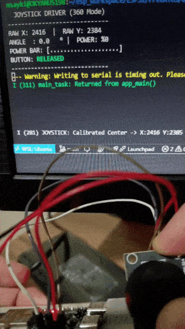
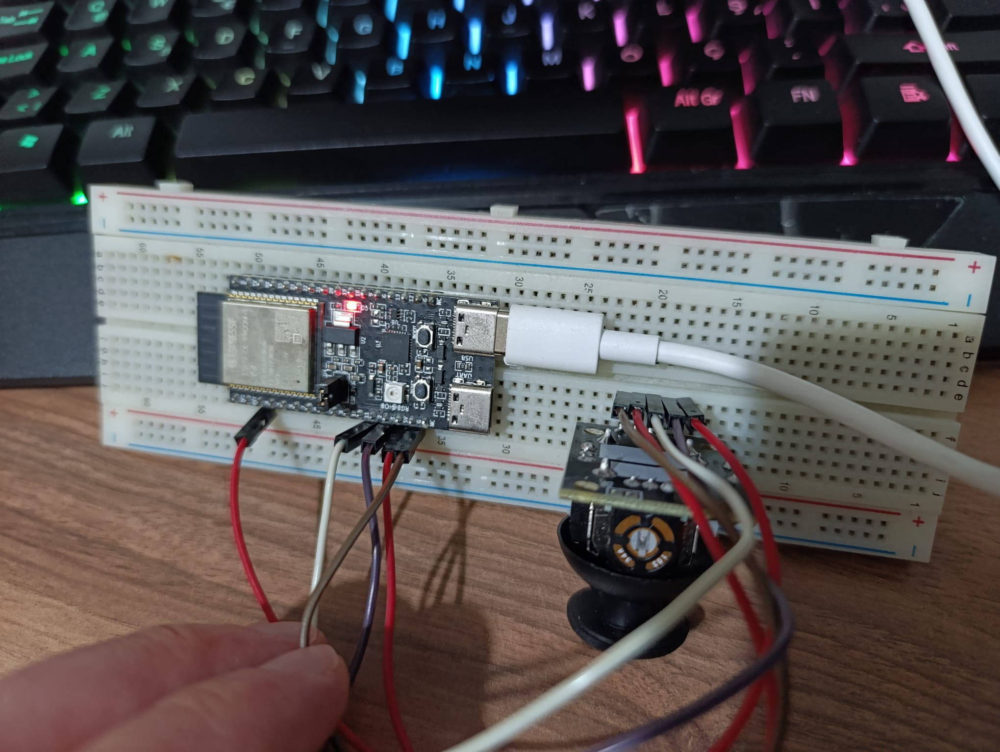

# 🕹️ Advanced ESP32-C6 Joystick Driver (FreeRTOS & Trigonometry)

This project is a professional-grade **Analog Joystick Driver** implementation for the **ESP32-C6**, built on **FreeRTOS**. 

Unlike simple examples, this driver features **Advanced Mathematics (Trigonometry)** for 360-degree angle detection, **Auto-Calibration**, and a Hybrid architecture supporting both simple directional logic and complex vector analysis.

## 🎥 Live Demo

## 🚀 Key Features

### 🧠 Core Logic
* **360° Vector Analysis:** Uses `atan2()` and `sqrt()` to calculate precise **Angle (0-360°)** and **Power Magnitude (0-100%)**.
* **Auto-Calibration:** Automatically detects the joystick's resting position (Center) on startup to eliminate hardware drift.
* **Adaptive Scaling:** Corrects physical hardware limitations (incomplete range) using a custom radius mapping algorithm.
* **Hybrid Mode:** Switch between **8-Way Directional** (D-Pad style) and **360° Analog** mode using a simple Macro (`ENABLE_360_LOGIC`).

### ⚡ System Architecture
* **Producer-Consumer Model:** Decoupled architecture using FreeRTOS Queues.
* **ADC OneShot:** ESP-IDF v5.x compatible ADC driver for high-performance analog reading.
* **Ghosting Fix:** Optimized CLI output using ANSI escape codes for a flicker-free terminal experience.
* **Visual Power Bar:** Real-time ASCII progress bar visualization for joystick intensity.

## ⚙️ Configuration

You can switch between modes in `main.c`:

    // Set to 1 for 360° Math Mode (Angle & Power)
    // Set to 0 for Classic 8-Way Mode (Right, Left, Up, Down...)
    #define ENABLE_360_LOGIC     1

## 🛠️ Wiring Connections

This project is configured for the **ESP32-C6** (DevKit) and a standard **KY-023 Joystick Module**.

| Joystick Pin | ESP32-C6 Pin | Description |
| :--- | :--- | :--- |
| **VCC** | 3.3V / 5V | Power Supply |
| **GND** | GND | Ground |
| **VRx** | **GPIO 3** | Analog X Axis (ADC1 Channel 3) |
| **VRy** | **GPIO 2** | Analog Y Axis (ADC1 Channel 2) |
| **SW** | **GPIO 4** | Button (Switch) - Active Low |

*(Note: The X and Y axes are logically aligned in the software. Includes specific correction for inverted Y-axis data standard in embedded graphics.)*

### 📸 Hardware Setup

Here is the actual wiring setup on the breadboard:

## 📂 Software Architecture

The system consists of two main Tasks:

1.  **ADC Reader Task (Producer):**
    * Reads raw sensor data (X, Y, Button) at 10Hz (100ms).
    * Packages data into a `struct` and pushes it to `xJoystickQueue`.
    
2.  **Controller Task (Consumer):**
    * **Startup:** Performs "Zero-Point" calibration using the first received data packet.
    * **Loop:** Consumes data from the queue and applies mathematical formulas.
    * **Output:** Renders specific metrics (Raw Data, Angle, Power %) to the serial monitor.

## 💻 How to Run?

To build and flash the project to the board:

    idf.py build
    idf.py flash
    idf.py monitor